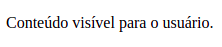
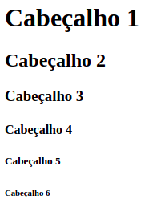
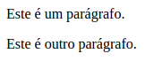
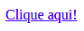
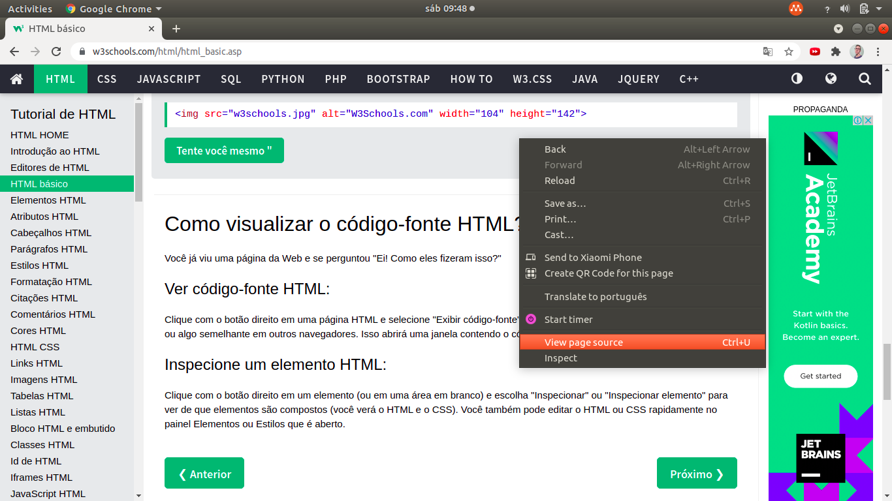
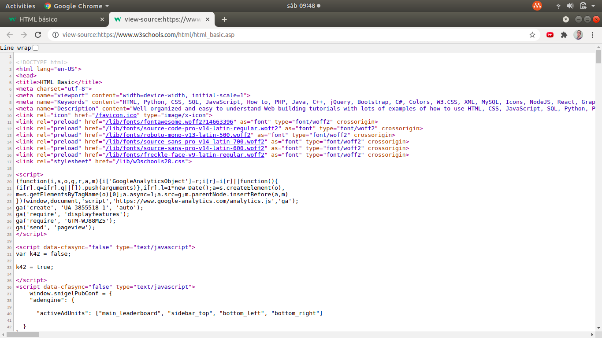
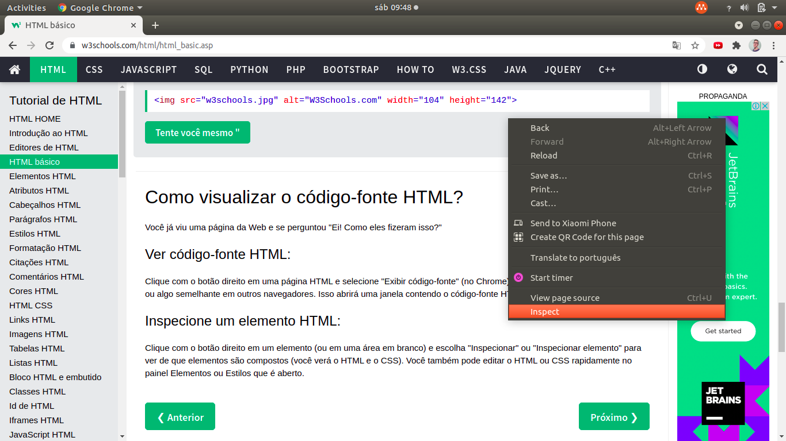
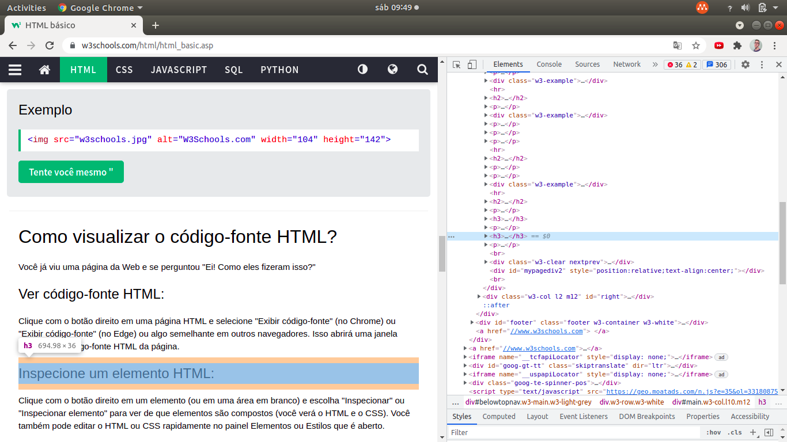

<html>
<body>
   <article id="d0dad24a-f3fb-4933-b197-b7b3c4c1cdeb" class="page mono">
      <header>
         

         <h1 class="page-title">HTML</h1>
         <table class="properties">
            <tbody>
               <tr class="property-row property-row-select">
                  <th>
                     
                        <svg viewBox="0 0 14 14" style="width:14px;height:14px;display:block;fill:rgba(55, 53, 47, 0.4);flex-shrink:0;-webkit-backface-visibility:hidden" class="typesSelect">
                           <path d="M7,13 C10.31348,13 13,10.31371 13,7 C13,3.68629 10.31348,1 7,1 C3.68652,1 1,3.68629 1,7 C1,10.31371 3.68652,13 7,13 Z M3.75098,5.32278 C3.64893,5.19142 3.74268,5 3.90869,5 L10.09131,5 C10.25732,5 10.35107,5.19142 10.24902,5.32278 L7.15771,9.29703 C7.07764,9.39998 6.92236,9.39998 6.84229,9.29703 L3.75098,5.32278 Z"></path>
                        </svg>
                     
                     Level
                  </th>
                  <td>Introductory</td>
               </tr>
               <tr class="property-row property-row-relation">
                  <th>
                     
                        <svg viewBox="0 0 14 14" style="width:14px;height:14px;display:block;fill:rgba(55, 53, 47, 0.4);flex-shrink:0;-webkit-backface-visibility:hidden" class="typesRelation">
                           <polygon points="4.5 1 4.5 3 9.586 3 1 11.586 2.414 13 11 4.414 11 9.5 13 9.5 13 1"></polygon>
                        </svg>
                     
                     Related to Coding Projects (Files)
                  </th>
                  <td></td>
               </tr>
               <tr class="property-row property-row-multi_select">
                  <th>
                     
                        <svg viewBox="0 0 14 14" style="width:14px;height:14px;display:block;fill:rgba(55, 53, 47, 0.4);flex-shrink:0;-webkit-backface-visibility:hidden" class="typesMultipleSelect">
                           <path d="M4,3 C4,2.447715 4.447715,2 5,2 L12,2 C12.5523,2 13,2.447716 13,3 C13,3.55228 12.5523,4 12,4 L5,4 C4.447715,4 4,3.55228 4,3 Z M4,7 C4,6.447715 4.447715,6 5,6 L12,6 C12.5523,6 13,6.447716 13,7 C13,7.55228 12.5523,8 12,8 L5,8 C4.447715,8 4,7.55228 4,7 Z M4,11 C4,10.447715 4.447715,10 5,10 L12,10 C12.5523,10 13,10.447716 13,11 C13,11.55228 12.5523,12 12,12 L5,12 C4.447715,12 4,11.55228 4,11 Z M2,4 C1.44771525,4 1,3.55228475 1,3 C1,2.44771525 1.44771525,2 2,2 C2.55228475,2 3,2.44771525 3,3 C3,3.55228475 2.55228475,4 2,4 Z M2,8 C1.44771525,8 1,7.55228475 1,7 C1,6.44771525 1.44771525,6 2,6 C2.55228475,6 3,6.44771525 3,7 C3,7.55228475 2.55228475,8 2,8 Z M2,12 C1.44771525,12 1,11.5522847 1,11 C1,10.4477153 1.44771525,10 2,10 C2.55228475,10 3,10.4477153 3,11 C3,11.5522847 2.55228475,12 2,12 Z"></path>
                        </svg>
                     
                     Source
                  </th>
                  <td>W3Schools</td>
               </tr>
               <tr class="property-row property-row-select">
                  <th>
                     
                        <svg viewBox="0 0 14 14" style="width:14px;height:14px;display:block;fill:rgba(55, 53, 47, 0.4);flex-shrink:0;-webkit-backface-visibility:hidden" class="typesSelect">
                           <path d="M7,13 C10.31348,13 13,10.31371 13,7 C13,3.68629 10.31348,1 7,1 C3.68652,1 1,3.68629 1,7 C1,10.31371 3.68652,13 7,13 Z M3.75098,5.32278 C3.64893,5.19142 3.74268,5 3.90869,5 L10.09131,5 C10.25732,5 10.35107,5.19142 10.24902,5.32278 L7.15771,9.29703 C7.07764,9.39998 6.92236,9.39998 6.84229,9.29703 L3.75098,5.32278 Z"></path>
                        </svg>
                     
                     Status
                  </th>
                  <td>Ongoing</td>
               </tr>
               <tr class="property-row property-row-relation">
                  <th>
                     
                        <svg viewBox="0 0 14 14" style="width:14px;height:14px;display:block;fill:rgba(55, 53, 47, 0.4);flex-shrink:0;-webkit-backface-visibility:hidden" class="typesRelation">
                           <polygon points="4.5 1 4.5 3 9.586 3 1 11.586 2.414 13 11 4.414 11 9.5 13 9.5 13 1"></polygon>
                        </svg>
                     
                     Tags
                  </th>
                  <td></td>
               </tr>
            </tbody>
         </table>
      </header>
      

         <h1 id="b0b454c7-43f1-48bb-b736-4640dc429f0b" class="">HTML básico ☑️</h1>
         
Neste capítulo, mostrarei alguns exemplos básicos de HTML.

         

         <ul id="dfcc787f-ebab-4221-ae63-36ffe2cfb46d" class="toggle">
            <li>
               

                  
<strong>Documentos HTML </strong>🆗

                  <h2 id="662771a7-4614-4a76-9a38-6db82940124a" class="">Documentos HTML</h2>
                  <ul id="b482b839-faa0-406c-b370-f7cb3dbd8c0b" class="bulleted-list">
                     <li style="list-style-type:disc"><code>&lt;!DOCTYPE html&gt;</code> declara para o navegador que o tipo do documento é HTML.</li>
                  </ul>
                  <ul id="dad9d768-f58c-4c54-9b87-f162fcc5ec5f" class="bulleted-list">
                     <li style="list-style-type:disc">O elemento raiz de uma página HTML começa com a tag <code>&lt;html&gt;</code> e termina com <code>&lt;/html&gt;</code>.</li>
                  </ul>
                  <ul id="c23c1a1d-bfb3-4227-a02e-66aff725e7f7" class="bulleted-list">
                     <li style="list-style-type:disc">A parte visível para o usuário do documento HTML se encontra entre <code>&lt;body&gt;</code> e <code>&lt;/body&gt;</code>.</li>
                  </ul>
                  <pre id="131c9100-a0fe-44ff-b8e2-badd9e50c238" class="code"><code>&lt;!DOCTYPE html&gt;
&lt;html&gt;
&lt;body&gt;
	&lt;p&gt;Conteúdo visível para o usuário.&lt;/p&gt;
&lt;/body&gt;
&lt;/html&gt;</code></pre>
                  <figure id="b70af17d-9280-49de-8f45-2bb490681dae" class="image"></figure>
                  

               

            </li>
         </ul>
         <ul id="d1741258-0a57-4eca-98ec-01647f949626" class="toggle">
            <li>
               

                  
<strong>&lt;!DOCTYPE html&gt; </strong>🆗

                  <h2 id="f30003c1-3b5a-4ad8-a8f6-a01e06df2ba9" class="">&lt;!DOCTYPE html&gt;</h2>
                  <ul id="5699b51c-4d37-4972-bef7-bfda9ae69e0c" class="bulleted-list">
                     <li style="list-style-type:disc">Representa o <code>tipo do documento</code>.</li>
                  </ul>
                  <ul id="47ac5683-9b09-4ae1-87f9-84e2f43350dd" class="bulleted-list">
                     <li style="list-style-type:disc">Ajuda os <code>navegadores</code> a exibir as páginas web corretamente.</li>
                  </ul>
                  <ul id="b8b10aa8-b6e5-4725-9a20-028dd9771115" class="bulleted-list">
                     <li style="list-style-type:disc">Deve aparecer <code>uma vez</code>, <code>antes</code> de qualquer tag HTML.</li>
                  </ul>
                  <ul id="3f8587b9-ff5d-41c4-91f5-5c81bf149f6e" class="bulleted-list">
                     <li style="list-style-type:disc"><code>Não diferencia</code> maiúsculas de minúsculas.</li>
                  </ul>
                  <pre id="70460f1b-560e-49c9-8008-6e846b40c16a" class="code"><code>&lt;!DOCTYPE html&gt;
&lt;html&gt;
...
&lt;/html&gt;</code></pre>
                  

               

            </li>
         </ul>
         <ul id="3d9dc114-a62f-4a9d-9869-07e789cc2e13" class="toggle">
            <li>
               

                  
<strong>Cabeçalhos HTML </strong>🆗

                  <h2 id="419beb0e-38c7-42dd-ac4b-06ded2a8148a" class="">Cabeçalhos HTML</h2>
                  <ul id="de5eba9d-3a58-49d7-bed4-cdca24faf260" class="bulleted-list">
                     <li style="list-style-type:disc">Cabeçalhos são <code>títulos</code>.</li>
                  </ul>
                  <ul id="ede742a9-99a1-42d8-8ca6-56c2ff134987" class="bulleted-list">
                     <li style="list-style-type:disc">O maior cabeçalho é o <code>&lt;h1&gt;</code> e o menor é o <code>&lt;h6&gt;</code>.</li>
                  </ul>
                  <pre id="cc40474c-355e-4595-8d9b-d8c4d2102af5" class="code"><code>&lt;h1&gt;Cabeçalho 1&lt;/h1&gt;
&lt;h2&gt;Cabeçalho 2&lt;/h2&gt;
&lt;h3&gt;Cabeçalho 3&lt;/h3&gt;
&lt;h4&gt;Cabeçalho 4&lt;/h4&gt;
&lt;h5&gt;Cabeçalho 5&lt;/h5&gt;
&lt;h6&gt;Cabeçalho 6&lt;/h6&gt;</code></pre>
                  <figure id="77ddac9f-f333-4658-b22d-5df7cc0e86c8" class="image"></figure>
                  

               

            </li>
         </ul>
         <ul id="89279aec-a4f1-42d5-83fd-65a65069e131" class="toggle">
            <li>
               

                  
<strong>Parágrafos HTML </strong>🆗

                  <h2 id="ec6927bf-39ef-495f-8d99-251851baab5c" class="">Parágrafos HTML</h2>
                  <ul id="4ae201bf-9229-45ce-9646-eabf84bafd38" class="bulleted-list">
                     <li style="list-style-type:disc">Parágrafos são <code>blocos de texto</code>.</li>
                  </ul>
                  <pre id="4ae77bab-cca2-4628-821b-7d5316ddbad3" class="code"><code>&lt;p&gt;Este é um parágrafo.&lt;/p&gt;
&lt;p&gt;Este é outro parágrafo.&lt;/p&gt;</code></pre>
                  <figure id="10fc8b6c-4d0f-4fef-b96a-34b805a50b1a" class="image"></figure>
                  

               

            </li>
         </ul>
         <ul id="714474bc-1e14-49da-9911-6cc206e5917f" class="toggle">
            <li>
               

                  
<strong>Links HTML </strong>🆗

                  <h2 id="311073b2-0377-4538-aabc-4f617a5932d6" class="">Links HTML</h2>
                  <ul id="b923d97d-788d-4322-8839-4be684d884d3" class="bulleted-list">
                     <li style="list-style-type:disc">Os links vão permitir que o usuário <code>acesse outras páginas web</code> ou <code>outros recursos</code>, como images, vídeos, áudios, PDFs etc.</li>
                  </ul>
                  <ul id="e766c8c7-4af5-4c79-80df-51e5d25d4d72" class="bulleted-list">
                     <li style="list-style-type:disc">Os links são definidos pela tag <code>&lt;a&gt;</code>.</li>
                  </ul>
                  <ul id="86e2928d-428a-48e1-a3ae-874b741fb5cf" class="bulleted-list">
                     <li style="list-style-type:disc">O atributo <code>href</code> especifica o destino do link.</li>
                  </ul>
                  <ul id="66c95be0-6829-4d43-9ad4-b58944a175d9" class="bulleted-list">
                     <li style="list-style-type:disc">Os <code>atributos</code> são usados para fornecer informações adicionais sobre os elementos HTML.</li>
                  </ul>
                  <pre id="bb6b7281-d8e3-4f19-b2d8-ed29a0df43ec" class="code"><code>&lt;a href=&quot;https://www.google.com&quot;&gt;Clique aqui!&lt;/a&gt;</code></pre>
                  <figure id="c60cf7cb-fe94-4ae8-b152-027ee04fc285" class="image"></figure>
                  

               

            </li>
         </ul>
         <ul id="a0c4ca87-0479-44bb-8f9a-cfa5be50b7db" class="toggle">
            <li>
               

                  
<strong>images HTML </strong>🆗

                  <h2 id="ee4368de-afe4-4681-9d4c-b70431bf64e2" class="">images HTML</h2>
                  <ul id="dc6e96ed-d772-46f3-bae5-740ef99260d8" class="bulleted-list">
                     <li style="list-style-type:disc">As images HTML são definidas pela tag <code>&lt;img&gt;</code>.</li>
                  </ul>
                  <ul id="131ab2d3-30f2-4364-a115-057d91c2d009" class="bulleted-list">
                     <li style="list-style-type:disc">O atributo <code>src</code> informa a localização do arquivo de origem da imagem.</li>
                  </ul>
                  <ul id="9bc54184-f0a1-4aab-b4c3-d297d34408e0" class="bulleted-list">
                     <li style="list-style-type:disc">O atributo <code>alt</code> mostra um texto alternativo (para caso a imagem não possa ter sido carregada por algum motivo).</li>
                  </ul>
                  <ul id="bb665a5a-2e2c-4fc7-8b28-bc1ce6535928" class="bulleted-list">
                     <li style="list-style-type:disc">O atributo <code>width</code> define a largura (horizontal) da imagem.</li>
                  </ul>
                  <ul id="64edc529-b968-44a2-bd4e-28fb39312139" class="bulleted-list">
                     <li style="list-style-type:disc">O atributo <code>height</code> a altura (vertical) da imagem.</li>
                  </ul>
                  <pre id="72fdc076-c366-45bf-b9f8-48284b916c0f" class="code"><code>&lt;img src=&quot;http://is.am/cao.jpg&quot; alt=&quot;Cãozin&quot; width=&quot;300&quot; height=&quot;200&quot;&gt;</code></pre>
                  <figure id="b0df7384-54e6-4cd2-aa7e-1f2ed1bf027e" class="image"></figure>
                  

               

            </li>
         </ul>
         <ul id="d2380532-bcdc-442d-ad55-66f14a3f6446" class="toggle">
            <li>
               

                  
<strong>Código-fonte de uma página web </strong>🆗

                  <h2 id="7dea35a7-0a1a-4ee7-a2d4-c9c12373933c" class="">Código-fonte de uma página web</h2>
                  <ul id="08c51e70-65a6-4586-aaa0-542546f3d737" class="bulleted-list">
                     <li style="list-style-type:disc">Para ver o código-fonte de uma página web: <code>Ctrl + U</code> ou <code>Botão direito do mouse</code> &gt; <code>View page source</code>.</li>
                  </ul>
                  <figure id="8a67f29b-31a3-412c-ae5f-6639eda499d0" class="image"></figure>
                  <figure id="f9c2a6ac-3486-4890-ae8c-fb68ae4b7307" class="image"></figure>
                  <ul id="918ab821-5e3a-4de7-b31a-0d9e3874d7f5" class="bulleted-list">
                     <li style="list-style-type:disc">Para examinar os componentes da página web sem sair da página: <code>Ctrl + Shift + I</code> ou <code>Botão direito do mouse</code> &gt; <code>Inspect</code>.</li>
                  </ul>
                  <figure id="0e328497-4046-4ed7-bd44-d42a8e9a55cd" class="image"></figure>
                  <figure id="cb9c9455-0328-4b65-a3c0-0775e16564a5" class="image"></figure>
                  

               

            </li>
         </ul>
      

   </article>
</body>
</html>
